# Lab Solution: AWS Cost Explorer and Cost Optimization

**Student Name:** Mos  
**Date:** 24.04.2026  
**Lab Completion Time:** 120 minutes

---

## Part 1: Cost Explorer Setup

### Screenshot 1: Cost Explorer Dashboard
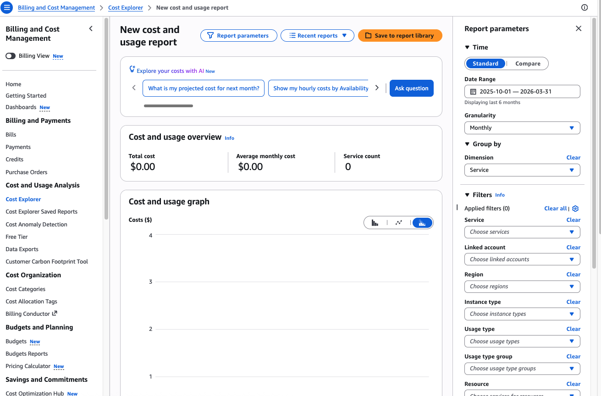

**Date Cost Explorer enabled (if new):** enabled by default

**Account has usage history:** X Yes ☐ No (If no, practiced with interface)
Some screenshots provided by instructor.

---

## Part 2: Historical Spending Analysis

### 6-Month Cost Trends

**Screenshot 2: 6-Month Trend**


**Total spend (last 6 months):** Approx. $2,800

**Average monthly:** Approx. $467

**Highest month:** October 2025, approx. $730

**Reason for highest month:**
```
Based on the instructor daily report from 2025-08-01 to 2026-01-31,
October appears to be the peak month because it contains the tallest
spike (about $155) plus several mid-October spikes around $90.
```

---

### Daily Cost Analysis

**Screenshot 3: Daily Analysis**
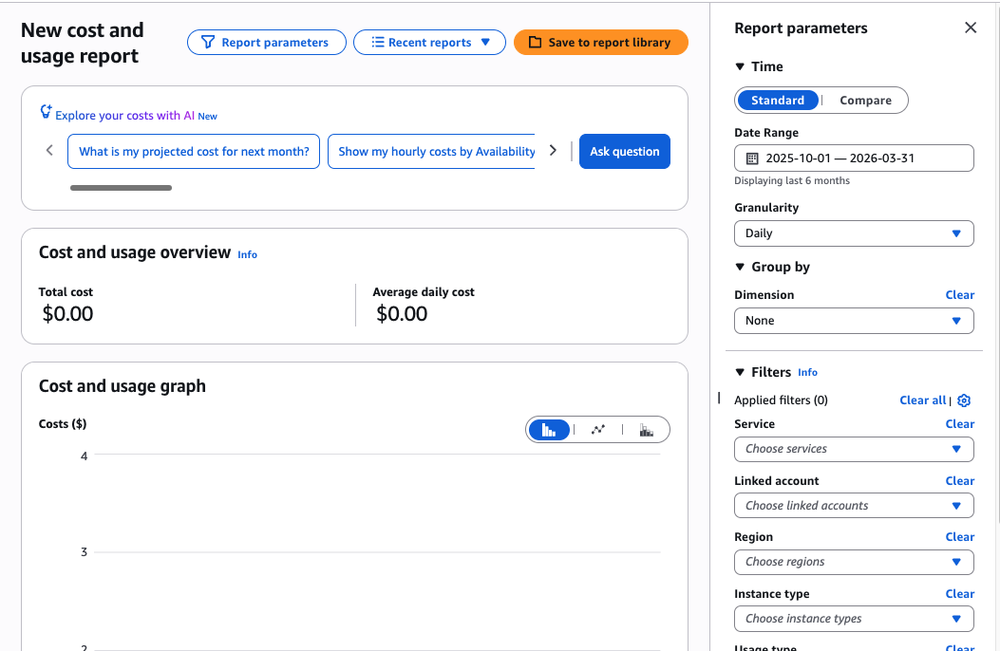

**Observations about daily patterns:**
```
- Date range: Jan 23–31, 2026 (9 days)
- Total cost: $58.78 | Average daily cost: $6.53
- Most days sit around $6.00, indicating a stable baseline spend
- Jan 30 is a clear spike at $10.06 roughly 54% above the daily average
- Jan 31 appears to drop back down to ~$6.00
```

---

## Part 3: Service-Level Analysis

### Top Cost Drivers

**Screenshot 4: Top Services**
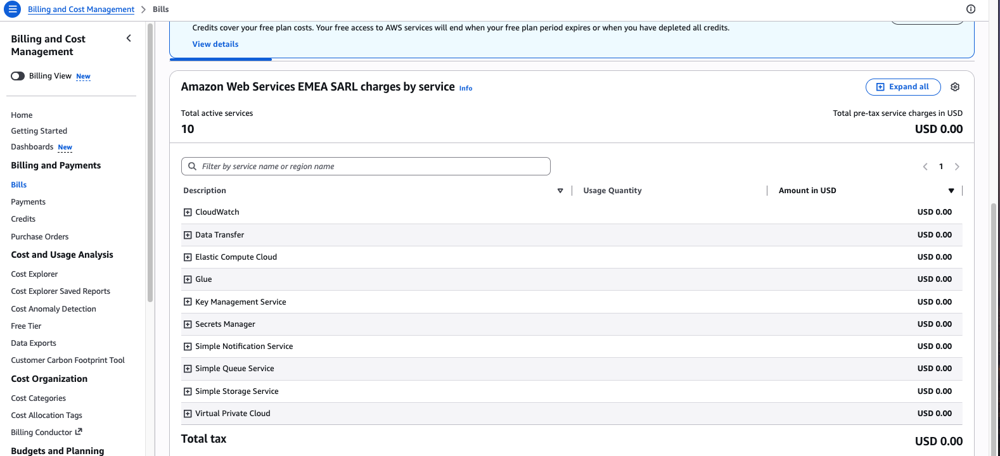

**Top 5 Services:**
1. Elastic Compute Cloud:    $89.24
2. Elastic Load Balancing:   $39.58
3. Virtual Private Cloud:    $37.21
4. Key Management Service:   $8.38
5. WAF:                      $8.00


---

### EC2 Cost Breakdown

**Screenshot 5: EC2 Breakdown**
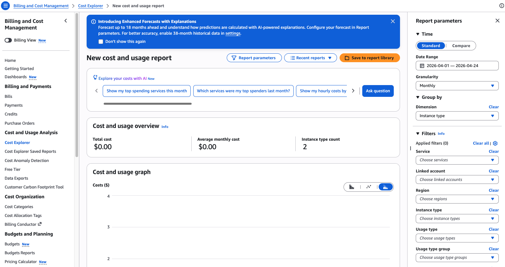

**Most expensive instance type:** No instance type (other)

**Total EC2 cost (last month):** $984.29

**Percentage of total bill:** ___________%

Data not available: available

**Usage type breakdown:**
- On-Demand: $_______________
- Reserved Instances: $_______________
- Spot Instances: $_______________
- Data Transfer: $_______________

---

### S3 Cost Breakdown

**Screenshot 6: S3 Breakdown**
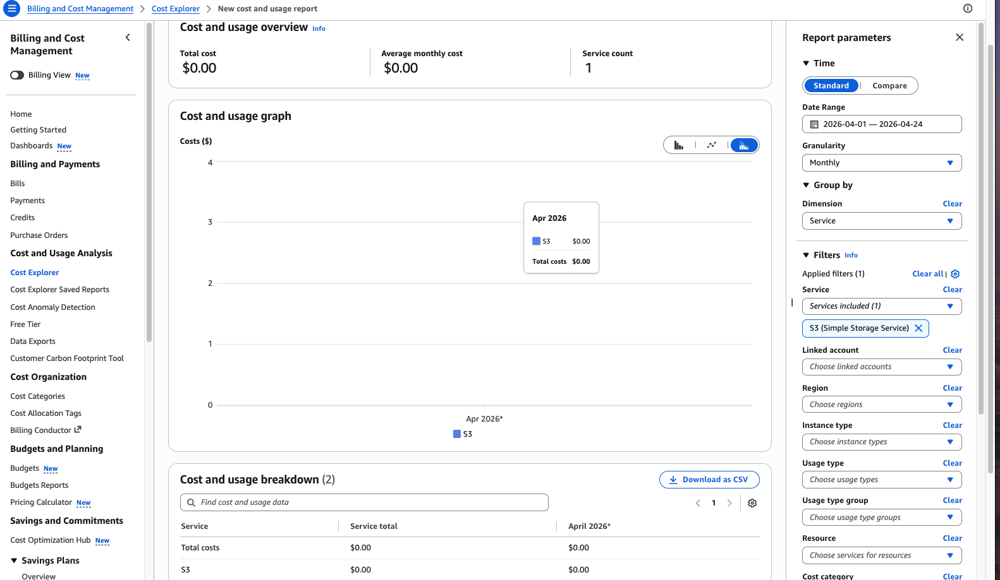

Data not available: available

**Total S3 cost:** $_______________

**Storage cost:** $_______________

**Request cost:** $_______________

**Data transfer cost:** $_______________

**Storage breakdown by class:**
- Standard: $_______________
- Intelligent-Tiering: $_______________
- Glacier: $_______________
- Other: $_______________

---

## Part 4: Advanced Filtering

### Cost by Region

**Screenshot 7: Regional Costs**
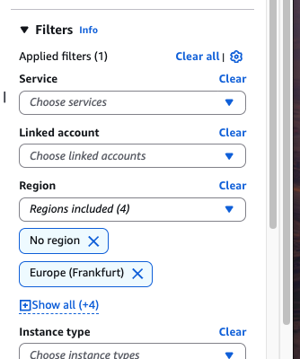

Data provided is only legend with availability zone, not region.

**Most expensive region:** top is "no zone" followed by eu-west-1b

**Cost:** $_______________

**Are you using resources in regions you don't need?**
```
_____________________________________________________________
_____________________________________________________________
```

---

### Cost by Tag

**Screenshot 8: Cost by Tag**
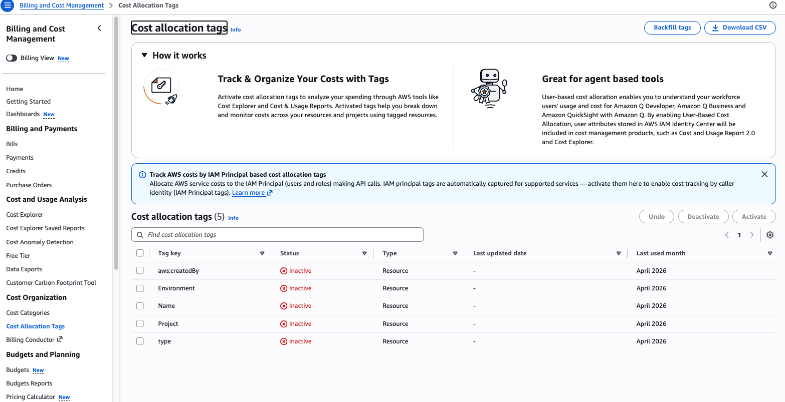

Data not available.

**Tags analyzed:** ☐ Environment ☐ Project ☐ Team x None available yet

**Cost breakdown by tag (if available):**
- Tag key: ___________________________
  - Value 1: _______________, $_______________
  - Value 2: _______________, $_______________
  - Value 3: _______________, $_______________

---

## Part 5: Cost Allocation Tags

### Activated Tags

**Screenshot 9: Activated Tags**
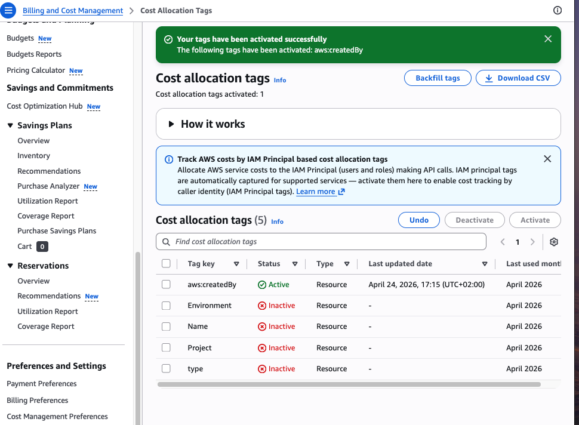

**AWS-Generated tags activated:**
- [x] aws:createdBy
- [ ] aws:cloudformation:stack-name
- [ ] Other: ___________________________

**Activation date:** 24.04.2026

---

### Tagging Strategy

**Screenshot 10: Tagged Resources**
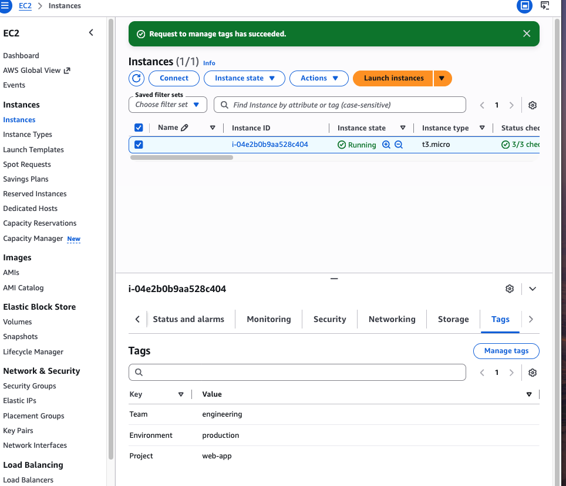

**Resources tagged:** ec2

**Tagging Plan:**

**Tag 1:**
- Key: Team
- Values: engineering, marketing, data
- Purpose: Attribute costs to the team responsible for each resource

**Tag 2:**
- Key: Environment
- Values: production, staging, development
- Purpose: Separate costs by environment to identify non prod overspend

**Tag 3:**
- Key: Project
- Values: web-app, internal-tools, data-pipeline
- Purpose: Track per project spend for budgeting and chargebacks

**How will these tags help with cost management?**
```
By consistently tagging all resources with Team, Environment, and Project,
Cost Explorer can be filtered and grouped to show exactly who is spending
what and where.
```

---

## Part 6: Custom Reports

### Report 1: Monthly Service Cost Report

**Screenshot 11: Monthly Report**


**Report configuration:**
- Date range: last 3 month
- Granularity: Monthly
- Group by: Service
- Chart type: Bar

---

### Report 2: Top 10 Services

**Screenshot 12: Top Services Pie Chart**
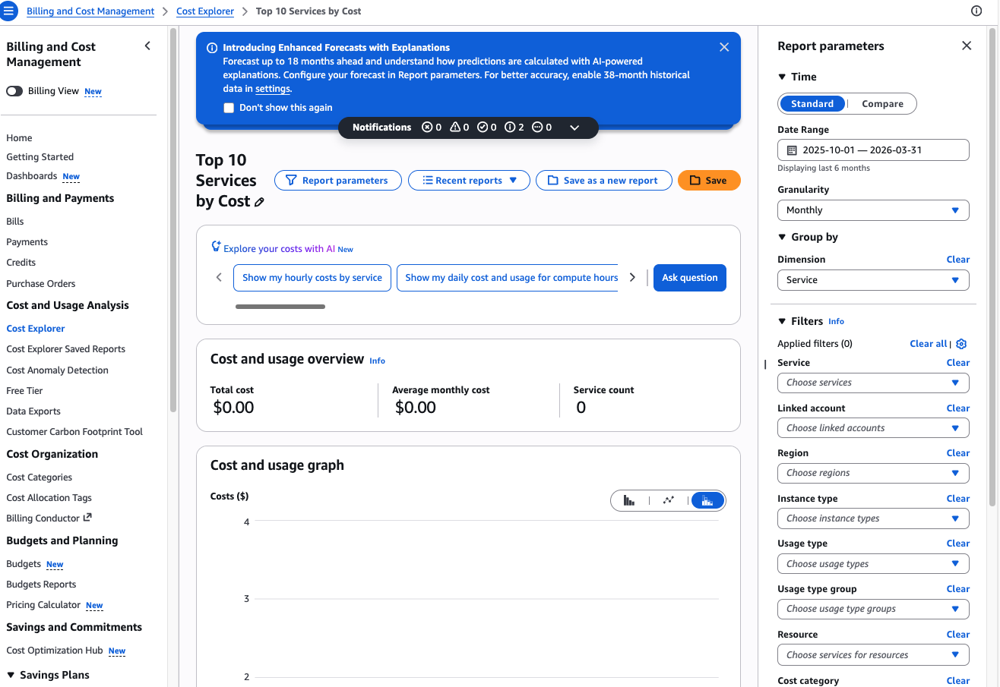

**Top 3 services from pie chart:**
1. ___________________________: _______%
2. ___________________________: _______%
3. ___________________________: _______%

---

### Report 3: Daily Cost Monitor

**Screenshot 13: Daily Monitor**
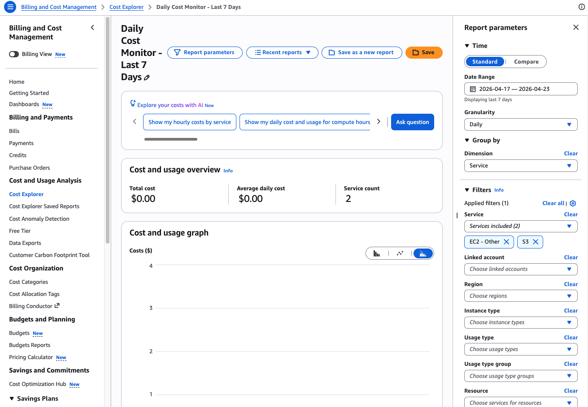

**How often will you review this report?**
```
I would check it once per day.
```

---

## Part 7: Cost Anomaly Detection

### All Services Monitor

**Screenshot 14: Anomaly Detection Monitor**
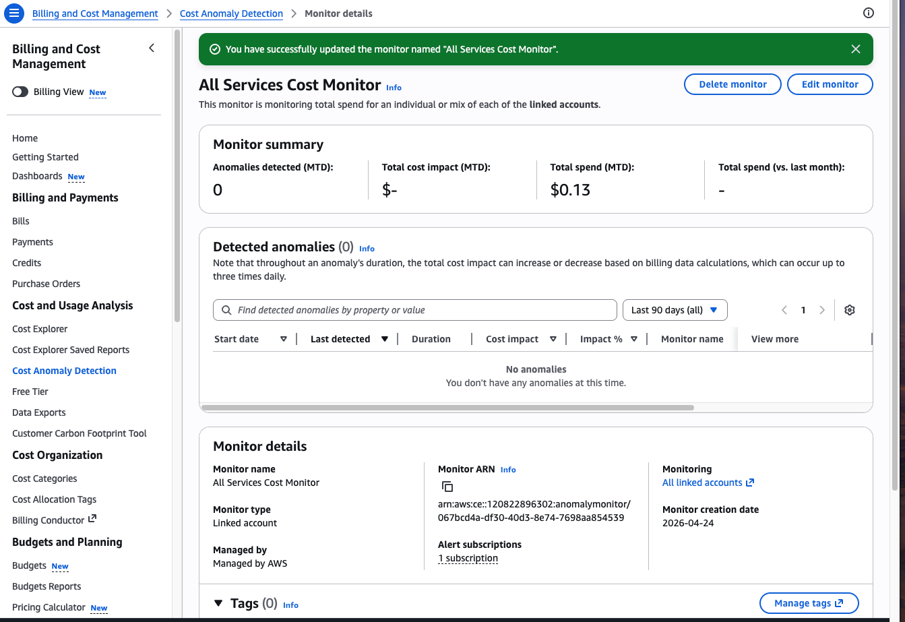

**Monitor name:** All Services Cost Monitor

**Threshold:** $10

**SNS topic:** cost-anomaly-alerts

**Email confirmed:** ☐ Yes x No -> used masked email

---

### Service-Specific Monitor

**Screenshot 15: Service Monitor**


**Services monitored:**
- [x] EC2
- [x] S3
- [ ] RDS
- [ ] Other: ___________________________

---

## Part 8: Optimization Opportunities

### AWS Recommendations

**Screenshot 16: Optimization Recommendations**
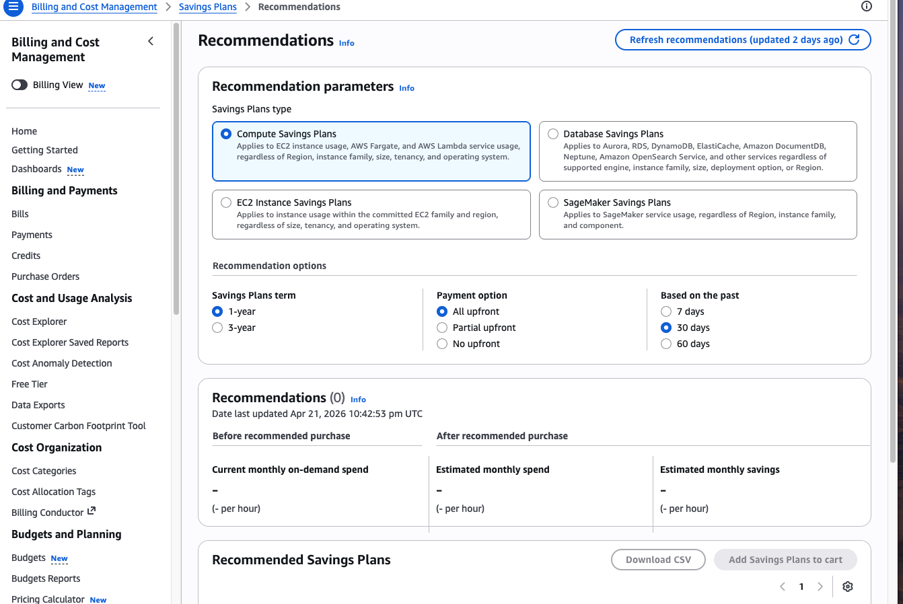

**Top 3 Recommendations:**

**1. Recommendation:**
```
_____________________________________________________________
```
- Potential savings: $_______________/month
- Effort to implement: ☐ Low ☐ Medium ☐ High
- Will implement: ☐ Yes ☐ No ☐ Maybe

**2. Recommendation:**
```
_____________________________________________________________
```
- Potential savings: $_______________/month
- Effort to implement: ☐ Low ☐ Medium ☐ High
- Will implement: ☐ Yes ☐ No ☐ Maybe

**3. Recommendation:**
```
_____________________________________________________________
```
- Potential savings: $_______________/month
- Effort to implement: ☐ Low ☐ Medium ☐ High
- Will implement: ☐ Yes ☐ No ☐ Maybe

**Total potential savings:** $_______________/month

---

### Idle Resources Audit

**Screenshot 17: Idle Resources**


**Idle resources identified:**

**Unattached EBS Volumes:**
- Count: _____
- Total size: _____ GB
- Monthly cost: $_______________

**Unassociated Elastic IPs:**
- Count: _____
- Monthly cost: $_______________

**Stopped EC2 Instances (still incurring EBS costs):**
- Count: _____
- Monthly cost: $_______________

**Old Snapshots (>90 days):**
- Count: _____
- Total size: _____ GB
- Monthly cost: $_______________

**Total idle resource cost:** $_______________/month

---

### Reserved Instance Analysis

**Current On-Demand EC2 spend:** $_______________/month

**Consistently running instances:**
- Instance type: ___________________________
- Quantity: _____
- Hours/month: _____

**Reserved Instance Pricing Comparison:**

| Term | Upfront | Monthly | Total Annual | Savings |
|------|---------|---------|--------------|---------|
| On-Demand | $0 | $_______ | $_______ | 0% |
| 1-Year, No Upfront | $0 | $_______ | $_______ | ___% |
| 1-Year, Partial Upfront | $_______ | $_______ | $_______ | ___% |
| 1-Year, All Upfront | $_______ | $0 | $_______ | ___% |

**Recommendation:**
```
_____________________________________________________________
_____________________________________________________________
```

---

## Part 9: Cost Optimization Action Plan

### Current State Assessment

**Monthly average spend:** $_______________

**Top 3 cost drivers:**
1. ___________________________
2. ___________________________
3. ___________________________

**Cost trend:** ☐ Increasing ☐ Stable ☐ Decreasing

**If increasing, by how much?** __________% over last 3 months

---

### Action Plan

**Quick Wins (Immediate - 0-1 week):**

**1.**
```
Action: ______________________________________________________
Expected savings: $_______________/month
Owner: ___________________________
Deadline: ___________________________
```

**2.**
```
Action: ______________________________________________________
Expected savings: $_______________/month
Owner: ___________________________
Deadline: ___________________________
```

**3.**
```
Action: ______________________________________________________
Expected savings: $_______________/month
Owner: ___________________________
Deadline: ___________________________
```

**Quick wins total savings:** $_______________/month

---

**Short-term (1-3 months):**

**1.**
```
Action: ______________________________________________________
Expected savings: $_______________/month
Owner: ___________________________
Deadline: ___________________________
```

**2.**
```
Action: ______________________________________________________
Expected savings: $_______________/month
Owner: ___________________________
Deadline: ___________________________
```

**3.**
```
Action: ______________________________________________________
Expected savings: $_______________/month
Owner: ___________________________
Deadline: ___________________________
```

**Short-term total savings:** $_______________/month

---

**Long-term (3-12 months):**

**1.**
```
Action: ______________________________________________________
Expected savings: $_______________/month
Owner: ___________________________
Deadline: ___________________________
```

**2.**
```
Action: ______________________________________________________
Expected savings: $_______________/month
Owner: ___________________________
Deadline: ___________________________
```

**3.**
```
Action: ______________________________________________________
Expected savings: $_______________/month
Owner: ___________________________
Deadline: ___________________________
```

**Long-term total savings:** $_______________/month

---

### Savings Summary

| Timeframe | Total Savings/Month | Annual Impact |
|-----------|-------------------|---------------|
| Quick Wins | $_______ | $_______ |
| Short-term | $_______ | $_______ |
| Long-term | $_______ | $_______ |
| **TOTAL** | **$_______** | **$_______** |

**Percentage reduction:** __________% of current spend

---

## Part 10: Stakeholder Report

### Report Export

**Screenshot 18: Exported Report**


**Report format:** ☐ CSV ☐ PNG ☐ PDF ☐ All

**Report includes:**
- [ ] Executive summary
- [ ] Cost trend charts
- [ ] Top cost drivers
- [ ] Optimization recommendations
- [ ] Action plan with ROI

---

## Reflection Questions

### 1. How often should you review Cost Explorer, and why?

**Your answer:**
```
_____________________________________________________________
_____________________________________________________________
_____________________________________________________________
```

### 2. Why are cost allocation tags important for enterprise AWS accounts?

**Your answer:**
```
_____________________________________________________________
_____________________________________________________________
_____________________________________________________________
```

### 3. Describe the trade-offs between Reserved Instances and On-Demand.

**Your answer:**
```
_____________________________________________________________
_____________________________________________________________
_____________________________________________________________
_____________________________________________________________
```

### 4. What is the value of Cost Anomaly Detection?

**Your answer:**
```
_____________________________________________________________
_____________________________________________________________
_____________________________________________________________
```

### 5. How would you present cost optimization findings to non-technical stakeholders?

**Your answer:**
```
_____________________________________________________________
_____________________________________________________________
_____________________________________________________________
_____________________________________________________________
```

---

## Self-Assessment

**Rate your confidence (1-5):**

| Skill | Before Lab | After Lab | Growth |
|-------|-----------|-----------|--------|
| Using Cost Explorer | ___/5 | ___/5 | +___ |
| Analyzing cost trends | ___/5 | ___/5 | +___ |
| Cost allocation tags | ___/5 | ___/5 | +___ |
| Identifying optimizations | ___/5 | ___/5 | +___ |
| Reserved Instance planning | ___/5 | ___/5 | +___ |
| Cost reporting | ___/5 | ___/5 | +___ |
| Anomaly detection | ___/5 | ___/5 | +___ |

---

## Instructor Verification

**Instructor Name:** ___________________________

**Date Reviewed:** ___________________________

**All reports completed:** ☐ Yes ☐ No

**Action plan realistic:** ☐ Yes ☐ No

**Comments:**
```
_____________________________________________________________
_____________________________________________________________
_____________________________________________________________
```

**Grade/Status:** ___________________________

---

**Lab Status:** ☐ Complete ☐ Needs Revision

**Submission Date:** ___________________________
